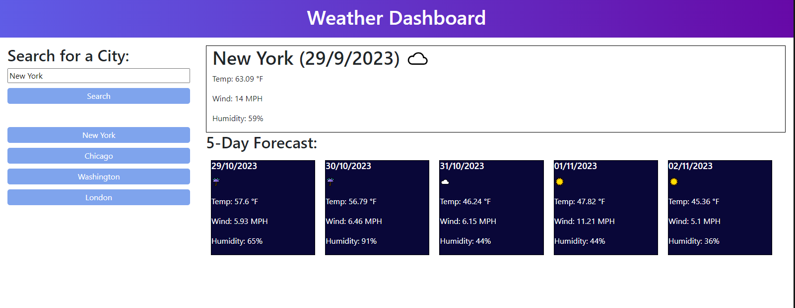

# Weather Dashboard

This website provides a means of searching the current weather of a city as well as the five-day forecast.
 It uses the OpenWeathermap API to first find the latitude and longitude of the searched city in order to format search parameters.
 It then provides the current weather in a larger box. The temperature, type of weather conditions, wind speed, and humidity will all be show.
 Five smaller boxes will be generated beneath that, displaying the same data forecasted for the next five days.
 Up to five previously searched cities will be saved in localStorage.
 The buttons representing previously searched cities can be clicked to once again retrieve their data.

### Sources
- Lines 237-240 constructed with assistance from Xpert Learning Assistant